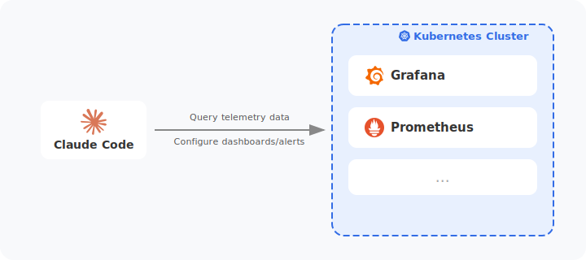
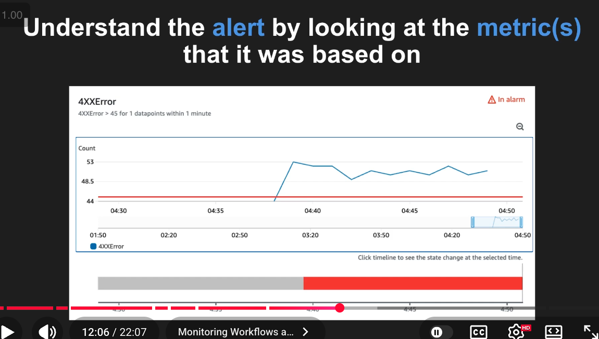
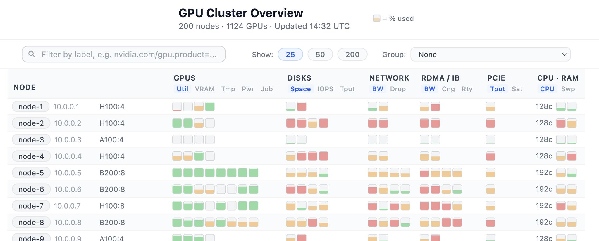

<h1 align="center">Auto-monitoring hackathon</h1>

  

  
  &nbsp;
  

- [Details](#details)
  - [When](#when)
  - [Where](#where)
- [Motivation](#motivation)
- [Main goal: ***what*** we'll build](#main-goal-what-well-build)
  - [Use case #1: Root cause analysis on a REST API](#use-case-1-root-cause-analysis-on-a-rest-api)
  - [Use case #2: Finding hardware bottlenecks in AI training](#use-case-2-finding-hardware-bottlenecks-in-ai-training)
- [Meta goal: ***how*** we'll build it](#meta-goal-how-well-build-it)
  - [Cutting scope](#cutting-scope)

## Details

### When

Friday all day - Saturday 3:30pm MT (April 10-11)

### Where

The [`#monitoring-hackathon`](https://discord.gg/GP5bbkJu) channel 

Lets chat in Discord leading up to it to come up with ideas.

## Motivation

Lets get better at observability. And lets make claude code be the SRE that uses the observability system.

I'm seeing monitoring companies talk about this and it sounds great:

- [Linkedin post](https://www.linkedin.com/posts/cloudwithraj_aiagents-observability-devops-activity-7442948487429677056-12ge?utm_source=share&utm_medium=member_desktop&rcm=ACoAABQ0dTIBFhHJFtMv3lM2Q2pAsPJWzp317fc) walking through an example with Honeycomb's MCP
- Datadog's [`pup` CLI repo](https://github.com/datadog-labs/pup) which is being built to accomplish the same thing

## Main goal: ***what*** we'll build

Stand up a "Claude Code friendly" monitoring stack on a kubernetes cluster. Apply this to 2 use cases where we can "let Claude Code loose" to solve problems.

### Use case #1: Root cause analysis on a REST API

Have Claude Code

1. Explore logs, traces, and metrics to find the root cause of `500` errors
1. Create a dashboard that makes the same analysis easy in the future
1. Create an alert to proactively tell engineers when to look at the dashboard
1. Identify blind spots in our data and recommend more telemetry to collect, e.g. enriching logs with correlation IDs, adding attributes, tracking more custom metrics, etc.

This video walks through an example root-cause analysis workflow. Imagine claude doing this autonomously.

Summary of the steps in the video:

1. Notice there are 500 errors
2. Look up traces for those errors and sample a few.
3. From a few traces, look up the logs from the trace ID.
4. From the logs, find a traceback and realize that it was due to bad params being passed to the endpoint at Line 14 in `endpoints.py`.
5. Reference the repo for that service to find Line 14 in `endpoints.py`. Explain why the inputs shown in the request logs are causing a failure and propose fixes.

### Use case #2: Finding hardware bottlenecks in AI training

Have Claude Code

1. Launch a multi-node distributed training job to finetune an LLM
2. Explore logs and metrics about every piece of hardware the job touches to determine what bottlenecks are preventing the GPU from being fully utilized, e.g. batches of training data are not loading fast enough due to (GPUs and VRAM, Local disk pressure, Network pressure, Infiniband/RDMA pressure, Network storage, CPUs and RAM)
3. Identify blind spots in our data and recommend more telemetry to collect, e.g. if certain hardware such as network interface cards (NICs) or disk drives are not tracked.

Here's a visualization I made to illustrate the type of data I'd like to collect for distributed training. Full vibe-coded HTML page with fake data in [`./docs/cluster-view.html`](./docs/cluster-view.html).

## Meta goal: ***how*** we'll build it

The hackathon goal is not to build this system.

The hackathon goal is to build a system (harness) that builds this system.

I want to draw inspiration from Andrej Karpathy's [autoresearch](https://github.com/karpathy/autoresearch) project. 

It

1. runs headlessly, even overnight
2. runs experiments
3. verifies the work (is it better than before?)
4. rollback if not

This may slow us down, but let's pause to think about

1. how can we break our work into small tasks?
2. what access can we give claude to do these tasks on its own?
3. how can we enable claude to self-verify if the task was a success?
4. how can we prevent us and our claude sessions from stepping on each other?
5. how can we test for regressions?
6. how can we provide claude with a fresh, reset environment so we can revert to the last "good" state when we don't like it's work?

Initial ideas for a development environment

1. create some K8s clusters in the cloud (script this setup)
2. give claude code unlimited `kubectl` access to one of the clusters
3. run claude code on our laptops inside docker to limit its reach (install `helm`, `kubectl`, `git`, `claude`, etc.)
4. try out MCPs, CLIs, Skills, etc. so claude can see the results of its actions
5. commit a .md file to `main` that acts as a task tracker for claude to update

For [1], [SkyPilot](https://docs.skypilot.co/en/latest/docs/index.html) can take a set of SSH keys and IPs and install k3s onto it. AND it's a tool for launching distributed training jobs.

### Cutting scope

We may not finish both use cases, but both require kubernetes, a monitoring stack, and enabling claude to explore metrics. Any progress toward that is a win.