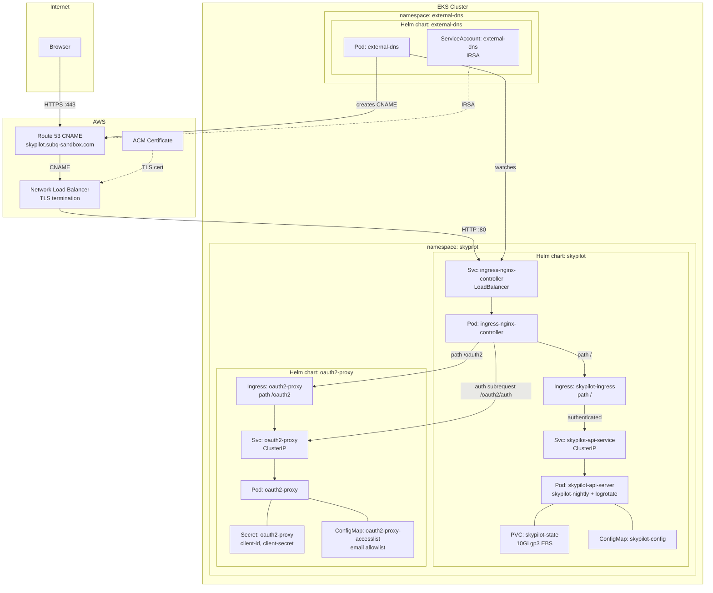
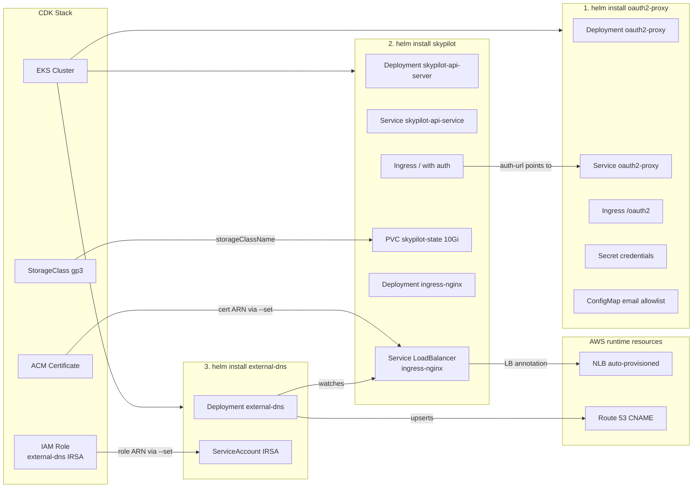

# infra

EKS cluster + SkyPilot for the hackathon.

## Setup

```bash
aws sso login --profile mlops-club
./run cdk-bootstrap       # one-time
./run cdk-deploy           # deploy EKS cluster + ACM cert + IAM roles
./run get-kubeconfig       # merge cluster into kubeconfig
# fill in .env with Google OAuth credentials (see .env.example)
./run install-skypilot     # install oauth2-proxy + SkyPilot + external-dns
```

## Architecture



## Deployment dependency graph

`./run install-skypilot` deploys three Helm charts in order. The SkyPilot chart bundles its own ingress-nginx subchart.



## OAuth

Google OAuth SSO via a standalone [oauth2-proxy](https://oauth2-proxy.github.io/oauth2-proxy/) deployment (official Helm chart).

- **Google project**: [consent screen](https://console.cloud.google.com/apis/credentials/consent?project=skypilot-hackathon) | [credentials](https://console.cloud.google.com/apis/credentials?project=skypilot-hackathon)
- **Redirect URI**: `https://skypilot.subq-sandbox.com/oauth2/callback`
- **Allowed emails**: edit `authenticatedEmailsFile.restricted_access` in `oauth2-proxy-values.yaml`, then re-run `./run install-skypilot`
- SkyPilot's built-in oauth2-proxy only supports domain filtering. We deploy oauth2-proxy separately (with per-email allowlist support) and use SkyPilot's `auth.externalProxy` to trust the `X-Auth-Request-Email` header.
- NLB terminates TLS but doesn't set `X-Forwarded-Proto`. The `proxySetHeaders` config in `skypilot-values.yaml` forces it to `https` so CSRF cookies work.
- **Browser note**: Brave's bounce-tracking protection blocks the CSRF cookie during the OAuth redirect chain. Use Chrome or lower Brave Shields for this site.

## DNS

`external-dns` automatically manages the `skypilot.subq-sandbox.com` CNAME in Route 53, pointing at the NLB.

## Notes

- [ ] What state does SkyPilot store in the EBS volume PVC vs in a separate Postgres DB?
