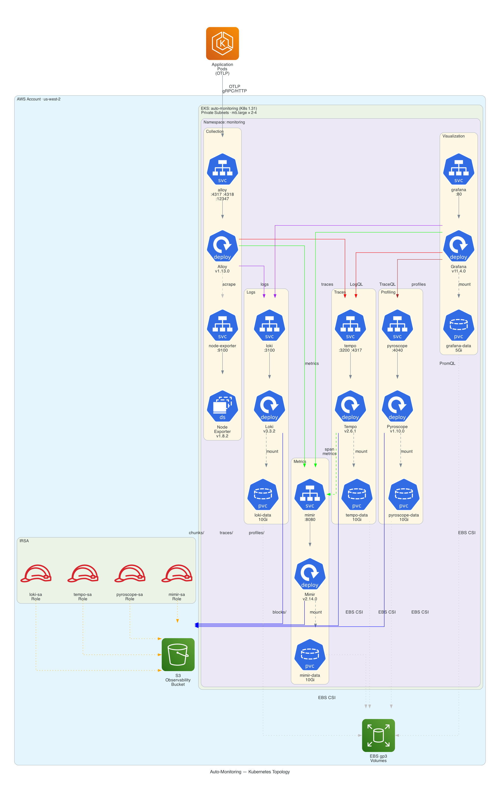
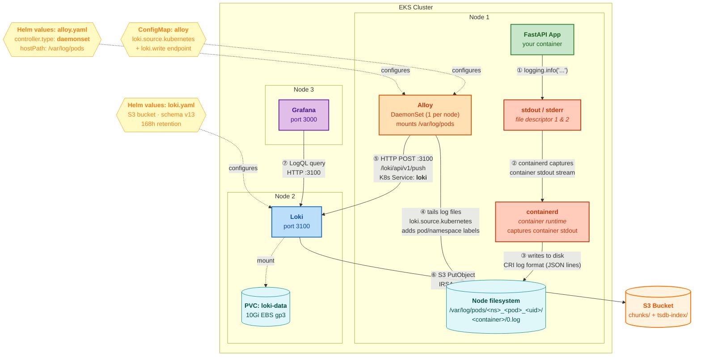
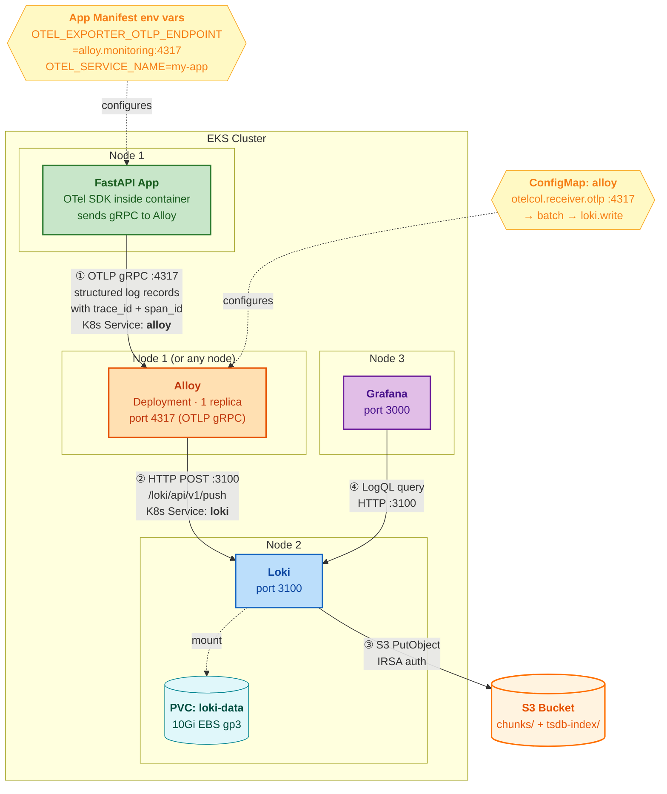
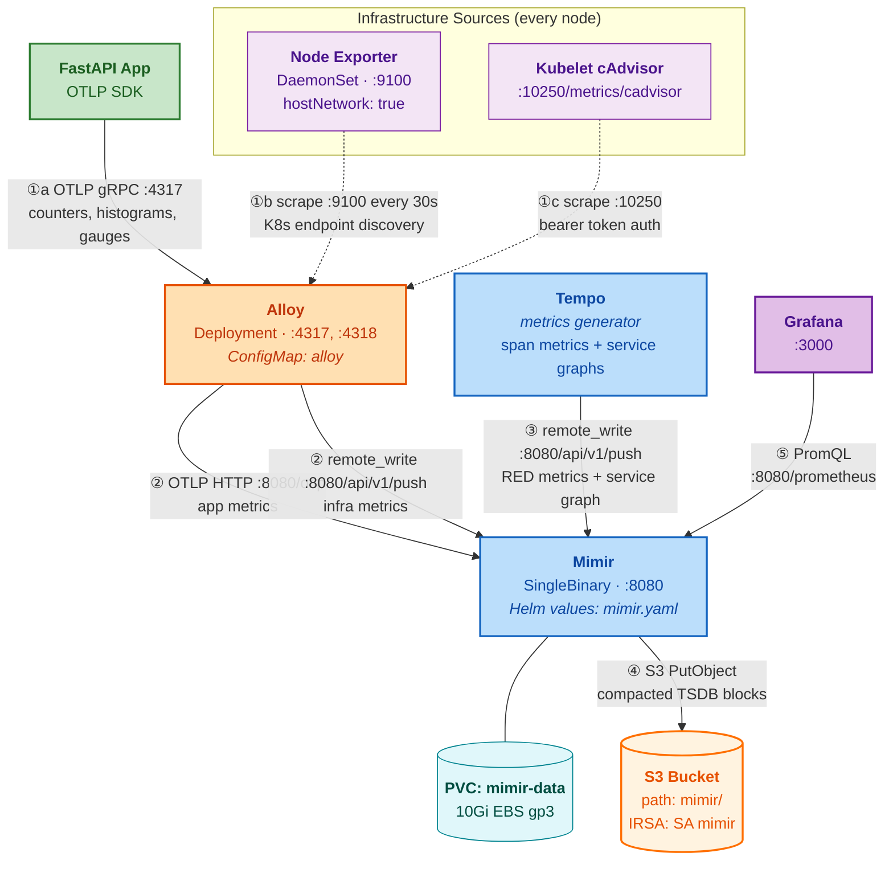
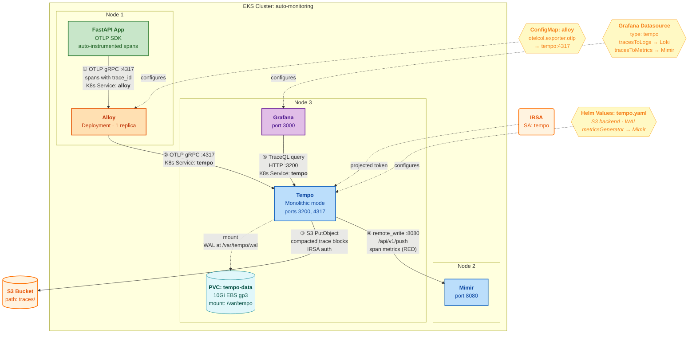

# Kubernetes Observability Topology

This document explains how the four-pillar observability stack (Metrics, Logs, Traces, Profiling) works on our EKS cluster. It traces the full path of each telemetry signal from a FastAPI application pod all the way to durable S3 storage, showing exactly which pods run on which nodes, how they find each other, and where every configuration comes from.

## Cluster Overview



The monitoring stack runs in the `monitoring` namespace on an EKS cluster with **2-4 m5.large nodes** (8 GiB RAM, 2 vCPU each). Every component is deployed via official Helm charts from the Grafana and Prometheus Community repositories.

### Pod Distribution Across Nodes

The Kubernetes scheduler distributes pods based on resource requests. DaemonSets (Node Exporter) run one pod per node. Deployments are scheduled wherever resources are available. A realistic 3-node spread looks like:

| Node | Pods | Why here |
|------|------|----------|
| **Node 1** | FastAPI App, Alloy | Alloy is a Deployment (1 replica), scheduled wherever there is room. Your app pods land on any node with capacity. |
| **Node 2** | Mimir, Loki | The heaviest pods (Mimir requests 256Mi, Loki 128Mi). Both have PVCs backed by EBS volumes that pin to a single AZ. |
| **Node 3** | Tempo, Pyroscope, Grafana | Remaining storage backends plus the dashboard UI. |
| **All Nodes** | Node Exporter _(DaemonSet)_ | Runs on every node to expose host CPU, memory, disk, and network metrics. Uses `hostNetwork: true` and `hostPID: true` to see the real host. |

### Storage Strategy: EBS + S3

Every storage backend uses a **two-tier** approach:

```
 Fast local disk (EBS gp3)         Durable object store (S3)
┌─────────────────────────┐      ┌──────────────────────────────┐
│  Write-Ahead Log (WAL)  │      │  Compacted blocks / chunks   │
│  TSDB index cache        │ ──►  │  Retained for 7 days (168h)  │
│  In-flight ingestion    │      │  Encrypted at rest (SSE-S3)  │
└─────────────────────────┘      └──────────────────────────────┘
   PVC (ReadWriteOnce)               Single S3 bucket, path-prefixed:
   10Gi per backend                    mimir/   loki/   tempo/   pyroscope/
   5Gi for Grafana
```

S3 access is authenticated via **IRSA** (IAM Roles for Service Accounts). CDK creates a Kubernetes ServiceAccount for each backend (`mimir`, `loki`, `tempo`, `pyroscope`) and annotates it with an IAM role ARN. The AWS SDK inside each pod automatically exchanges the projected service account token for temporary AWS credentials — no access keys stored anywhere.

---

## Logs: FastAPI to Loki to S3

There are two fundamentally different ways to get logs out of a containerized app. Understanding the difference matters because it determines what you need to change (if anything) in your application code, and how Alloy must be deployed.

### Path A: Stdout logs (zero code changes)

This is the path for any app that just writes to stdout — `print()`, the `logging` module, uvicorn's default output, or any third-party container you don't control. **No SDK, no instrumentation, no code changes.** The container runtime and Alloy handle everything.



#### Step-by-step: Life of a stdout log line

**Step ① — Your app writes to stdout.** This is just normal Python logging. No SDK, no special imports:

```python
# main.py — a completely ordinary FastAPI app
import logging
from fastapi import FastAPI

logging.basicConfig(level=logging.INFO, format="%(asctime)s %(levelname)s %(message)s")
logger = logging.getLogger("myapp")

app = FastAPI()

@app.get("/items/{item_id}")
async def get_item(item_id: int):
    logger.info(f"Fetching item {item_id}")      # ← goes to stdout, that's it
    return {"item_id": item_id}

# When uvicorn runs this, both uvicorn's access logs and your logger.info()
# calls are written to the container's stdout (file descriptor 1).
```

There is **nothing special** about this app. It has no idea observability infrastructure exists.

**Step ② — containerd captures stdout.** When Kubernetes starts your container, the container runtime (`containerd` on EKS) attaches to the container's stdout and stderr streams. Every line your app prints is intercepted by containerd before it ever reaches a terminal.

**Step ③ — containerd writes to a log file on the node's filesystem.** containerd writes each captured line to a JSON-formatted log file on the node at a well-known path:

```
/var/log/pods/<namespace>_<pod-name>_<pod-uid>/<container-name>/0.log
```

For example, if your pod is `my-fastapi-app-7b9f4d-xk2lm` in the `default` namespace:

```
/var/log/pods/default_my-fastapi-app-7b9f4d-xk2lm_a1b2c3/fastapi/0.log
```

Each line in this file is a JSON object written by containerd in **CRI log format**:

```json
{"log":"2026-04-08 14:23:01,123 INFO Fetching item 42\n","stream":"stdout","time":"2026-04-08T14:23:01.123Z"}
```

This is not something you configure. It is how Kubernetes works. Every container's stdout ends up as a file on the node.

**Step ④ — Alloy tails the log files.** This is the critical piece. Alloy runs as a **DaemonSet** — one pod on every node — and mounts the host's `/var/log/pods` directory. It uses Kubernetes service discovery to learn which pods exist, then tails their corresponding log files on disk.

The Alloy Helm values must be configured for this:

```yaml
# helm/values/alloy.yaml — key changes for stdout collection
controller:
  type: daemonset          # ← MUST be daemonset, not deployment

alloy:
  mounts:
    varlog: true           # ← mounts /var/log from the host into the Alloy pod
```

And the Alloy config (in the ConfigMap) needs a log collection pipeline:

```alloy
// In ConfigMap: alloy → config.alloy

// Step 1: Discover all pods on this node
discovery.kubernetes "pods" {
  role = "pod"
}

// Step 2: Filter to only pods on THIS node, add useful labels
discovery.relabel "pod_logs" {
  targets = discovery.kubernetes.pods.targets

  // Only tail pods running on the same node as this Alloy instance
  rule {
    source_labels = ["__meta_kubernetes_pod_node_name"]
    target_label  = "__host__"
  }

  // Carry forward useful labels so you can filter in Grafana
  rule {
    source_labels = ["__meta_kubernetes_namespace"]
    target_label  = "namespace"
  }
  rule {
    source_labels = ["__meta_kubernetes_pod_name"]
    target_label  = "pod"
  }
  rule {
    source_labels = ["__meta_kubernetes_pod_container_name"]
    target_label  = "container"
  }
}

// Step 3: Tail the log files from /var/log/pods/...
loki.source.kubernetes "pod_logs" {
  targets    = discovery.relabel.pod_logs.output
  forward_to = [loki.write.default.receiver]
}

// Step 4: Push to Loki
loki.write "default" {
  endpoint {
    url = "http://loki:3100/loki/api/v1/push"
  }
}
```

The `loki.source.kubernetes` component is doing the heavy lifting. Internally, it:
1. Takes the pod targets from discovery
2. Maps each target to its log file path under `/var/log/pods/` (which is mounted from the host)
3. Tails each file, parsing the CRI JSON log format
4. Attaches the `namespace`, `pod`, and `container` labels you set in the relabel step
5. Forwards each log line to `loki.write`

**Step ⑤ — Alloy pushes to Loki.** The `loki.write` component batches log lines and POSTs them to Loki's push API at `http://loki:3100/loki/api/v1/push`. The `loki` DNS name resolves via the Kubernetes Service created by the Loki Helm chart.

**Steps ⑥–⑦** are the same as any path: Loki indexes locally on its EBS PVC, flushes chunks to S3 via IRSA, and Grafana queries via LogQL.

> **Key takeaway:** For stdout collection, the app needs zero changes. The work is entirely in how Alloy is deployed (DaemonSet + host volume mount) and configured (discovery + file tailing). This is the right choice for third-party containers, sidecars, or any app where you can't (or don't want to) add an SDK.

---

### Path B: OTLP SDK logs (structured, with trace correlation)

If you control the application code and want richer, structured logs that automatically correlate with traces, you can instrument the app with the OpenTelemetry SDK. Logs are sent directly to Alloy over the network — no filesystem involved.



#### FastAPI app instrumented with OpenTelemetry logging

```python
# main.py — FastAPI app with OTel log instrumentation
import logging
from fastapi import FastAPI
from opentelemetry import trace
from opentelemetry.exporter.otlp.proto.grpc._log_exporter import OTLPLogExporter
from opentelemetry.sdk._logs import LoggerProvider, LoggingHandler
from opentelemetry.sdk._logs.export import BatchLogRecordProcessor
from opentelemetry.sdk.resources import Resource
from opentelemetry.sdk.trace import TracerProvider
from opentelemetry.exporter.otlp.proto.grpc.trace_exporter import OTLPSpanExporter
from opentelemetry.sdk.trace.export import BatchSpanProcessor
from opentelemetry.instrumentation.fastapi import FastAPIInstrumentor

# ── Resource identifies this service in Grafana ──────────────────
resource = Resource.create({"service.name": "my-fastapi-app"})

# ── Traces (so log records carry trace_id automatically) ─────────
tracer_provider = TracerProvider(resource=resource)
tracer_provider.add_span_processor(
    BatchSpanProcessor(OTLPSpanExporter())    # reads OTEL_EXPORTER_OTLP_ENDPOINT
)
trace.set_tracer_provider(tracer_provider)

# ── Logs via OTLP ───────────────────────────────────────────────
logger_provider = LoggerProvider(resource=resource)
logger_provider.add_log_record_processor(
    BatchLogRecordProcessor(OTLPLogExporter())  # reads OTEL_EXPORTER_OTLP_ENDPOINT
)

# Bridge Python's logging module → OTel log records
handler = LoggingHandler(logger_provider=logger_provider)
logging.getLogger().addHandler(handler)
logging.getLogger().setLevel(logging.INFO)

logger = logging.getLogger("myapp")

# ── FastAPI ─────────────────────────────────────────────────────
app = FastAPI()
FastAPIInstrumentor.instrument_app(app)  # auto-creates spans for each request

@app.get("/items/{item_id}")
async def get_item(item_id: int):
    logger.info(f"Fetching item {item_id}")
    # This log record is now an OTel LogRecord, automatically enriched with:
    #   - trace_id  (from the active span created by FastAPIInstrumentor)
    #   - span_id
    #   - service.name = "my-fastapi-app"
    # It is sent via OTLP gRPC to the endpoint in OTEL_EXPORTER_OTLP_ENDPOINT.
    return {"item_id": item_id}
```

The app's **Deployment manifest** sets the endpoint via env var:

```yaml
# In the app's Deployment spec
env:
  - name: OTEL_EXPORTER_OTLP_ENDPOINT
    value: "http://alloy.monitoring.svc.cluster.local:4317"
  - name: OTEL_SERVICE_NAME
    value: "my-fastapi-app"
```

The OTel SDK reads `OTEL_EXPORTER_OTLP_ENDPOINT` automatically. It sends log records as gRPC protobuf to Alloy. Each log record carries `trace_id` and `span_id` fields, which means in Grafana you can click a log line and jump directly to its trace in Tempo.

For this path, Alloy can run as a **Deployment** (not a DaemonSet), because it receives logs over the network, not from files. The receiver is the same `otelcol.receiver.otlp` that handles metrics and traces — all three signals are multiplexed over the same gRPC connection.

#### When to use which path

| | Stdout (Path A) | OTLP SDK (Path B) |
|---|---|---|
| **Code changes needed** | None | Add OTel SDK + handler |
| **Trace correlation** | No `trace_id` on logs | Automatic `trace_id` + `span_id` |
| **Structured fields** | Only if you log as JSON | Native structured attributes |
| **Third-party containers** | Works for anything | Only for code you control |
| **Alloy deployment** | DaemonSet + host volume mount | Deployment (network receiver) |
| **Best for** | nginx, postgres, sidecars, any "black box" | Your own application services |

You can (and should) use **both paths at the same time**: Alloy as a DaemonSet collecting stdout from all containers, plus the OTLP receiver for apps that are instrumented. Both paths converge at the same `loki.write` endpoint, so all logs end up in the same Loki instance and are queryable together in Grafana.

---

## Metrics: FastAPI to Mimir to S3

Metrics arrive from two sources: **application metrics** via OTLP and **infrastructure metrics** scraped from Node Exporter and kubelet's cAdvisor endpoint.



### Step-by-step: Life of a Metric

**Step ①a — Application metrics.** The FastAPI app's OTLP SDK sends metrics (counters, histograms, gauges) via gRPC to Alloy on port 4317. Same `OTEL_EXPORTER_OTLP_ENDPOINT` env var as for logs — the OTLP protocol multiplexes all three signals over one connection.

**Step ①b — Node Exporter scraping.** Alloy uses Kubernetes endpoint discovery to find all Node Exporter pods, then scrapes their `/metrics` endpoint every 30 seconds. The discovery and scraping logic is in the **Alloy ConfigMap**:

```alloy
# From ConfigMap: alloy → config.alloy
discovery.kubernetes "endpoints" {
  role = "endpoints"
  namespaces { names = ["monitoring"] }
}

discovery.relabel "node_exporter" {
  targets = discovery.kubernetes.endpoints.targets
  rule {
    source_labels = ["__meta_kubernetes_service_name"]
    regex         = "node-exporter"     # ← matches the Helm Service name
    action        = "keep"
  }
}

prometheus.scrape "node_exporter" {
  targets         = discovery.relabel.node_exporter.output
  scrape_interval = "30s"
  forward_to      = [prometheus.remote_write.mimir.receiver]
}
```

The Alloy pod can discover these endpoints because the Helm chart creates a **ClusterRole** with `get`/`list`/`watch` permissions on endpoints, pods, and nodes (set via `rbac.create: true` in `helm/values/alloy.yaml`).

**Step ①c — Kubelet cAdvisor scraping.** Alloy also scrapes container-level CPU, memory, and I/O metrics from each kubelet's built-in cAdvisor endpoint at `https://<node-ip>:10250/metrics/cadvisor`. This replaces the need for a separate cAdvisor DaemonSet. Authentication uses the bearer token from the Alloy pod's own ServiceAccount:

```alloy
prometheus.scrape "cadvisor" {
  scheme            = "https"
  bearer_token_file = "/var/run/secrets/kubernetes.io/serviceaccount/token"
  tls_config { insecure_skip_verify = true }
}
```

**Step ②** — Alloy forwards metrics to Mimir through two paths:
- **Application metrics** go via the OTLP exporter to `http://mimir:8080/otlp` (OTLP HTTP)
- **Infrastructure metrics** (from scraping) go via Prometheus remote write to `http://mimir:8080/api/v1/push`

Both URLs resolve via the `mimir` Kubernetes Service (created by the Helm chart with `fullnameOverride: mimir`).

**Step ③ — Tempo's metrics generator.** Tempo produces **span metrics** (request rate, error rate, duration histograms per endpoint) and **service graph** edges from incoming traces. It pushes these as Prometheus metrics to Mimir via remote write. This is configured in the Tempo Helm values:

```yaml
# From helm/values/tempo.yaml
tempo:
  metricsGenerator:
    enabled: true
    remoteWriteUrl: "http://mimir:8080/api/v1/push"
```

**Step ④** — Mimir ingests metrics into its local TSDB at `/data/mimir/tsdb` (EBS PVC), then periodically compacts and uploads blocks to S3 under the `mimir/` prefix. The storage backend is configured in the Helm values:

```yaml
# From helm/values/mimir.yaml
mimir:
  structuredConfig:
    common:
      storage:
        backend: s3
        s3:
          bucket_name: auto-monitoring-obs-292783887127  # envsubst fills this
          region: us-west-2
    blocks_storage:
      storage_prefix: mimir       # S3 key prefix
```

**Step ⑤** — Grafana queries Mimir using PromQL at `http://mimir:8080/prometheus`, configured as the default datasource in `helm/values/grafana.yaml`. Exemplar links connect metrics to traces in Tempo via the `trace_id` label.

---

## Traces: FastAPI to Tempo to S3

Traces follow the same initial path as logs and metrics — through the OTLP multiplexed connection — but are then routed to Tempo for storage and Mimir for derived metrics.



### Step-by-step: Life of a Trace

**Step ①** — The FastAPI app is instrumented with the OpenTelemetry Python SDK (typically via `opentelemetry-instrument` auto-instrumentation). Each incoming HTTP request creates a root span; outgoing calls to databases or other services create child spans. The SDK serializes the full trace as OTLP protobuf and sends it via gRPC to `alloy.monitoring.svc.cluster.local:4317`.

The key piece of config on the app side:

```yaml
# In the FastAPI app's Deployment manifest
env:
  - name: OTEL_EXPORTER_OTLP_ENDPOINT
    value: "http://alloy.monitoring.svc.cluster.local:4317"
  - name: OTEL_SERVICE_NAME
    value: "my-fastapi-app"
  - name: OTEL_TRACES_EXPORTER
    value: "otlp"           # this is the default
  - name: OTEL_LOGS_EXPORTER
    value: "otlp"           # so logs also flow through OTLP
```

**Step ②** — Alloy receives the trace in its `otelcol.receiver.otlp` component, batches it, and forwards it to Tempo. Unlike logs (HTTP) and metrics (OTLP HTTP), **traces use OTLP gRPC** for the Alloy→Tempo hop:

```alloy
# From ConfigMap: alloy → config.alloy
otelcol.exporter.otlp "tempo" {
  client {
    endpoint = "tempo:4317"          # ← K8s Service DNS, gRPC
    tls { insecure = true }          # ← in-cluster, no TLS needed
  }
}
```

Alloy connects to the `tempo` Kubernetes Service on port 4317. The Service routes to the Tempo pod's gRPC listener (configured in `helm/values/tempo.yaml` as `receivers.otlp.protocols.grpc.endpoint: "0.0.0.0:4317"`).

**Step ③** — Tempo writes incoming spans to its **Write-Ahead Log (WAL)** at `/var/tempo/wal` on the EBS-backed PVC. Periodically, it flushes completed trace blocks to S3. The storage config comes from the Helm values:

```yaml
# From helm/values/tempo.yaml
tempo:
  storage:
    trace:
      backend: s3
      s3:
        bucket: auto-monitoring-obs-292783887127   # envsubst fills this
        region: us-west-2
      wal:
        path: /var/tempo/wal   # on the PVC
  retention: 168h              # 7 days
```

**Step ④ — Derived span metrics.** Tempo's built-in **metrics generator** processes every incoming span and produces:
- **Span metrics**: per-endpoint RED (Rate, Errors, Duration) histograms, dimensioned by `service.name`, `http.method`, `http.status_code`, `http.target`
- **Service graph** edges: which service calls which, with latency and error rates

These metrics are pushed to Mimir via Prometheus remote write at `http://mimir:8080/api/v1/push`. This is how Grafana can show a **service map** and **RED dashboards** without any custom metric instrumentation in your app — Tempo derives them from traces.

**Step ⑤** — Grafana queries Tempo via TraceQL at `http://tempo:3200` (the Tempo HTTP API port). The datasource config in `helm/values/grafana.yaml` enables powerful cross-linking:

```yaml
# From helm/values/grafana.yaml → datasources
- name: Tempo
  type: tempo
  url: http://tempo:3200
  jsonData:
    tracesToLogsV2:
      datasourceUid: loki         # click a span → see its logs
    tracesToMetrics:
      datasourceUid: mimir        # click a span → see its metrics
    tracesToProfilesV2:
      datasourceUid: pyroscope    # click a span → see its CPU profile
    nodeGraph:
      enabled: true               # service dependency graph
    serviceMap:
      datasourceUid: mimir        # service map powered by span metrics
```

This cross-linking means you can start with a slow trace, jump to the correlated logs to see error messages, pivot to the metrics to see if it was a systemic issue, and drill into the CPU flame graph to find the bottleneck — all without leaving Grafana.

---

## How It All Connects: Configuration Sources

Every connection between pods is configured in exactly one place. Here is the complete reference:

| Connection | Protocol | Port | Configured In | Config Mechanism |
|---|---|---|---|---|
| App → Alloy | OTLP gRPC | 4317 | App Deployment manifest | `OTEL_EXPORTER_OTLP_ENDPOINT` env var |
| Alloy → Loki | HTTP POST | 3100 | `helm/values/alloy.yaml` | Rendered into ConfigMap `alloy`, key `config.alloy` |
| Alloy → Mimir (app metrics) | OTLP HTTP | 8080 | `helm/values/alloy.yaml` | ConfigMap `alloy` → `otelcol.exporter.otlphttp` |
| Alloy → Mimir (infra metrics) | Prom remote write | 8080 | `helm/values/alloy.yaml` | ConfigMap `alloy` → `prometheus.remote_write` |
| Alloy → Tempo | OTLP gRPC | 4317 | `helm/values/alloy.yaml` | ConfigMap `alloy` → `otelcol.exporter.otlp` |
| Alloy → Node Exporter | Prom scrape | 9100 | `helm/values/alloy.yaml` | ConfigMap `alloy` → `prometheus.scrape` with K8s discovery |
| Alloy → Kubelet cAdvisor | Prom scrape | 10250 | `helm/values/alloy.yaml` | ConfigMap `alloy` → `prometheus.scrape` with bearer token |
| Tempo → Mimir | Prom remote write | 8080 | `helm/values/tempo.yaml` | `metricsGenerator.remoteWriteUrl` in Helm values |
| Grafana → Mimir | PromQL HTTP | 8080 | `helm/values/grafana.yaml` | Datasource provisioning YAML |
| Grafana → Loki | LogQL HTTP | 3100 | `helm/values/grafana.yaml` | Datasource provisioning YAML |
| Grafana → Tempo | TraceQL HTTP | 3200 | `helm/values/grafana.yaml` | Datasource provisioning YAML |
| Grafana → Pyroscope | HTTP | 4040 | `helm/values/grafana.yaml` | Datasource provisioning YAML |
| Mimir → S3 | HTTPS | 443 | `helm/values/mimir.yaml` | `structuredConfig.common.storage.s3` + IRSA |
| Loki → S3 | HTTPS | 443 | `helm/values/loki.yaml` | `loki.storage.bucketNames` + IRSA |
| Tempo → S3 | HTTPS | 443 | `helm/values/tempo.yaml` | `tempo.storage.trace.s3` + IRSA |
| Pyroscope → S3 | HTTPS | 443 | `helm/values/pyroscope.yaml` | `pyroscope.config` storage block + IRSA |

### Why K8s Services Matter

Every pod-to-pod connection above uses a **Kubernetes Service** DNS name (e.g., `mimir`, `loki`, `tempo`). These short names work because all pods are in the same `monitoring` namespace. The full DNS name is `<service>.monitoring.svc.cluster.local`, but the short form is sufficient within the namespace.

Each Helm chart creates its Service automatically. We set `fullnameOverride: <name>` in every values file so the Service names are clean and predictable (e.g., `mimir` instead of `mimir-mimir-distributed`).

### IRSA: How Pods Authenticate to S3

```
CDK creates:
  1. S3 Bucket (with bucket policy)
  2. IAM Role (with S3 read/write permissions)
  3. OIDC trust policy (only pods with matching SA can assume the role)
  4. K8s ServiceAccount (annotated with the IAM role ARN)

At runtime:
  Pod mounts projected SA token → AWS SDK detects IRSA →
  Calls STS AssumeRoleWithWebIdentity → Gets temporary credentials →
  Uses credentials for S3 API calls
```

The Helm charts are told `serviceAccount.create: false` and `serviceAccount.name: <name>` so they use the CDK-created ServiceAccounts rather than creating their own.
